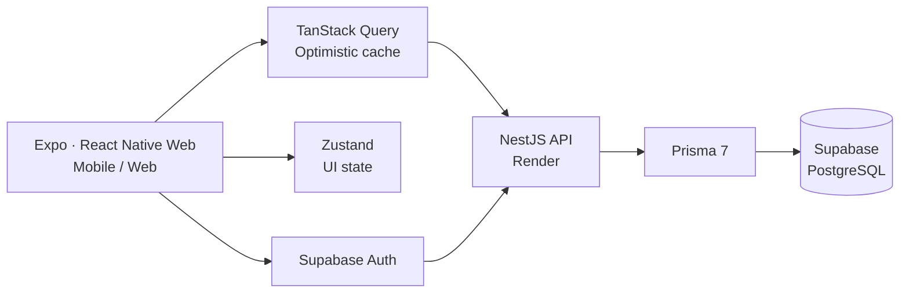

<div align="center">

# Largon Portfolio

### 비즈니스의 문제를 코드로 번역하고, 끊김 없는 경험을 설계하는 프론트엔드 개발자 이재호의 포트폴리오

[](https://largonportfolio.vercel.app/)
[](https://react.dev/)
[](https://vitejs.dev/)

[Portfolio](https://largonportfolio.vercel.app/) · [GitHub](https://github.com/ewsn0825/portfolio) · [TaskFlow](https://taskflow-kanban-rouge.vercel.app/)

</div>

## Overview

프로젝트의 구현 결과만 나열하지 않고, 문제를 어떻게 발견하고 해결했는지 보여 주는 단일 페이지 포트폴리오입니다. React 기반의 가벼운 인터랙션과 프로젝트별 기술 의사결정을 함께 담았습니다.

## Featured · TaskFlow

> **웹과 모바일의 흐름을 하나로 연결한 개인용 칸반 보드**

TaskFlow는 보드·컬럼·카드를 직관적으로 구성하고, 빠른 드래그 앤 드롭과 낙관적 업데이트로 서버 응답을 기다리지 않는 조작 경험을 제공하는 개인 업무 관리 앱입니다.

[서비스 보기](https://taskflow-kanban-rouge.vercel.app/) · [API 문서](https://kanban-board-app-pse5.onrender.com/api) · [GitHub](https://github.com/ewsn0825/kanban-board-app)

| 영역 | 구현 |
| --- | --- |
| Client | Expo, React Native Web, React 19, TypeScript |
| 상태·통신 | TanStack Query, Zustand, Axios |
| Server | NestJS 11, Prisma 7, PostgreSQL |
| 인증 | Supabase Auth, ES256 JWT 검증 |
| Deploy | Vercel, Render, Supabase |

### Engineering highlights

- **마지막 의도 보존:** 카드별 이동 요청을 병합·직렬화해 빠르게 여러 번 드래그해도 사용자의 마지막 이동 결과가 유지되도록 했습니다.
- **동시성 안전성:** PostgreSQL advisory lock과 트랜잭션, 임시 위치 전환으로 카드 순서 유니크 제약 충돌을 해결했습니다.
- **즉각적인 반응과 복구:** 변경을 TanStack Query 캐시에 먼저 반영하고, 실패한 요청만 서버 상태로 동기화해 빠른 UX와 데이터 일관성을 함께 확보했습니다.
- **필요한 데이터만:** 보드 목록은 메타데이터만 불러오고, 선택된 보드만 상세 조회합니다. 컬럼별 카드 맵은 `useMemo`로 재사용해 드래그 중 렌더링 비용을 줄였습니다.



## Portfolio experience

| 관심사 | 적용 |
| --- | --- |
| 빠른 첫 화면 | 정적인 Hero를 즉시 노출해 불필요한 800ms 로딩 지연을 제거했습니다. |
| 점진적 로딩 | About, Experience, Skills, Projects, Contact를 독립적인 `Suspense` 경계로 분리해 무거운 프로젝트 섹션이 다른 콘텐츠를 막지 않게 했습니다. |
| 스크롤 성능 | 내비게이션의 스크롤 처리를 `requestAnimationFrame`과 passive listener로 조정하고, 상태가 실제로 바뀔 때만 갱신합니다. |
| 이미지 안정성 | 프로젝트 미리보기의 고정 비율 컨테이너와 `loading="lazy"`, `decoding="async"`로 레이아웃 흔들림과 초기 네트워크 부담을 낮췄습니다. |
| 모바일 GPU | 비용이 큰 Hero blur 효과를 `md` 이상에서만 렌더링합니다. |

## Tech stack

| Category | Stack |
| --- | --- |
| Core | React 18, Vite, React Router |
| Styling | Tailwind CSS |
| Motion & UI | Framer Motion, React Scroll, Lucide React |
| Code quality | ESLint, Vite Plugin SVGR |

## Structure

```text
src/
├── assets/                 # 이미지와 기술 아이콘
├── components/
│   ├── ProjectCard.jsx     # 재사용 가능한 프로젝트 상세 카드
│   └── NavBar.jsx          # 스크롤 기반 내비게이션
├── data/
│   └── projects.js         # 프로젝트 콘텐츠와 링크를 한 곳에서 관리
├── pages/
│   ├── Landing.jsx         # Hero와 지연 로딩 섹션 경계
│   └── About.jsx, Projects.jsx, Skills.jsx ...
├── routes.jsx
└── main.jsx
```

## Run locally

```bash
git clone https://github.com/ewsn0825/portfolio.git
cd portfolio
npm install
npm run dev
```

| Command | Description |
| --- | --- |
| `npm run dev` | 로컬 개발 서버 실행 |
| `npm run build` | 프로덕션 빌드 생성 |
| `npm run preview` | 빌드 결과 미리보기 |
| `npm run lint` | ESLint 검사 |

## Project timeline

- **2026.07 – 2026.08** · TaskFlow — cross-platform 칸반 보드와 동시성 안전한 카드 정렬
- **2026.04 – 2026.05** · Asset Dashboard — 실시간 자산 시각화와 낙관적 업데이트
- **2024.05 – 2024.06 / 2026.05** · Largon Portfolio — 성능과 정보 전달을 다듬은 포트폴리오

---

<div align="center">
  Built with care by <a href="https://github.com/ewsn0825">Largon</a>.
</div>
